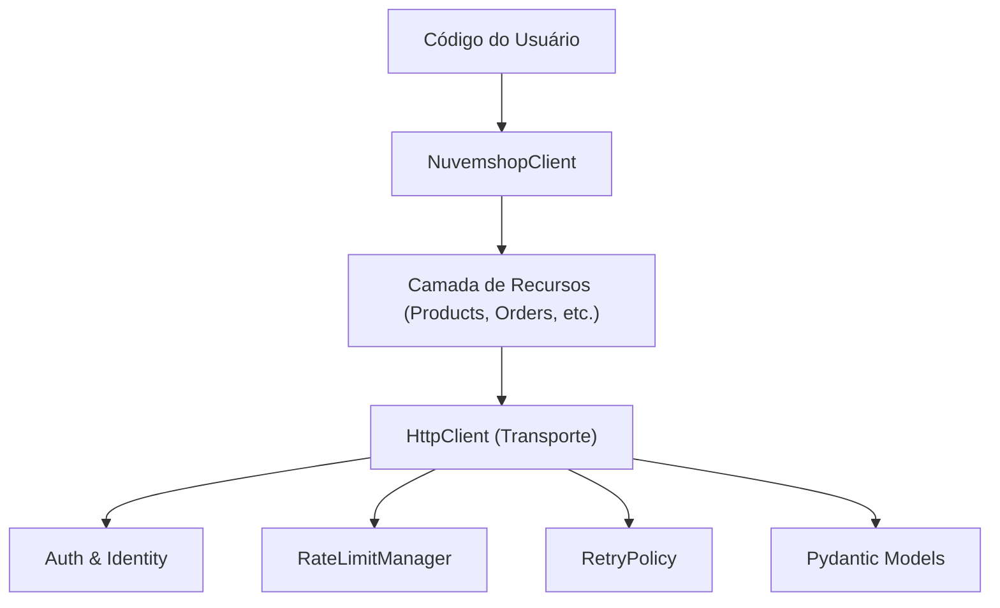

# Arquitetura do SDK Nuvemshop Python

Este documento descreve o design interno do SDK e como os diferentes componentes interagem.

## Visão Geral das Camadas

O SDK é estruturado em quatro camadas principais para garantir isolamento de responsabilidades e facilidade de manutenção.

### 1. NuvemshopClient (Ponto de Entrada)
O `NuvemshopClient` é a fachada principal. Ele agrega todos os recursos e gerencia a configuração global (tokens, timeouts, etc.).
- **Isolamento**: Cada instância do cliente é isolada por `store_id`.
- **Thread-Safety**: O cliente e o `RateLimitManager` são thread-safe por design.

### 2. Camada de Recursos (Resources)
Localizada em `src/nuvemshop_sdk/resources/`. Cada classe aqui mapeia para uma entidade da API Nuvemshop.
- `ResourceCRUD`: Classe base que fornece métodos `get`, `list`, `create`, `update`, `patch`, `delete`.
- **Validação de Negócio**: Alguns recursos (como `InventoryResource`) impõem regras de negócio específicas da Nuvemshop (ex: estoque só pode ser atualizado via variante).

### 3. HttpClient (Transporte)
Localizado em `src/nuvemshop_sdk/http_client.py`. Coordena o ciclo de vida de cada requisição.
- **Idempotência**: Gera e reutiliza `Idempotency-Key` automaticamente em retries.
- **Logging Estruturado**: Emite logs JSON para observabilidade.
- **Tratamento de Erros**: Converte status HTTP em exceções tipadas.

### 4. Rate Limiting e Retries
Sistemas automáticos que garantem a resiliência do SDK:
- **RateLimitManager**: Monitora os headers `X-RateLimit-Remaining` e aplica esperas preemptivas. No caso de 429, aplica espera reativa.
- **RetryPolicy**: Executa backoff exponencial com jitter para erros de rede (NetworkError) e erros de servidor (5xx).

## Segurança de Dados

O SDK utiliza **Pydantic v2** com `extra="allow"` em todos os modelos (`src/nuvemshop_sdk/models/`). Isso garante que:
1. Novos campos adicionados pela API Nuvemshop não quebrem o SDK.
2. Os dados sejam validados e tipados conforme entram no sistema.
3. Objetos JSON sejam facilmente convertidos em objetos Python amigáveis.
